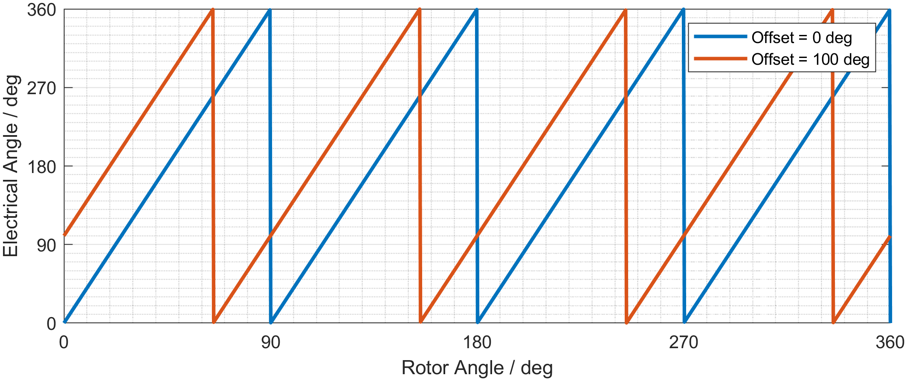

# Encoder Kalibration

Für die Umsetzung der feldorientierten Regelung wird der elektrische Winkel $\varphi_{el}$ benötigt. Dieser kann indirekt über eine Messung des Rotorwinkels mit  

$$
\varphi_{el} = pp \cdot \varphi_{r} + \varphi_{os}
$$

bestimmt werden. Der Nullwinkel des Rotors fällt in der Regel nicht mit dem elektrischen Nullwinkel zusammen, sodass beide um einen Offset-Winkel $\varphi_{os}$ phasenverschoben sind. 

<figure markdown="span">
  
  <figcaption>Offset-Winkel, Polpaarzahl = 4</figcaption>
</figure>



Der Konvention nach wird der Offset-Winkel in elektrischen Grad zwischen 0° und 360° angegeben und muss von der Regelungs-Applikation kompensiert werden. Nur bei einer exakten Kompensation stellen sich die korrekten Komponenten und Größen im dq-System ein. Im Folgenden werden verschiedene Verfahren zur Ermittelung des Offset-Winkels aufgeführt.


## Alignment-Verfahren

Das Alignment-Verfahren stellt eine verbreitete und einfache Möglichkeit zur Bestimmung des Offset-Winkels dar. Bei diesem Verfahren wird der elektrische Winkel von außen vorgegben und ein positiver d-Strom durch eine direkte Spannungsvorgabe oder vorzugsweise über die Stromregelung eingeprägt.


Alpha Strom 
dq -> nur echtes dq!


## Open-Loop-Verfahren

## Prüfstands-Verfahren

## Weitere Verfahren

HFI


Den verkoppelten Spannugsgleichungen im dq-System 

$$
\begin{aligned} 
u_d &= R_s i_d + L_d \frac{di_d}{dt} - \Omega_{el} L_q i_q \\
u_q &= R_s i_q + L_q \frac{di_q}{dt} + \Omega_{el} L_d i_d + \Omega_{el} {\Psi}_m 
\end{aligned}
$$


Matlab Code Beispiel: 
``` matlab linenums="1"
for i = 1:10
    t = i;
    # matlab comment here
end    
```

