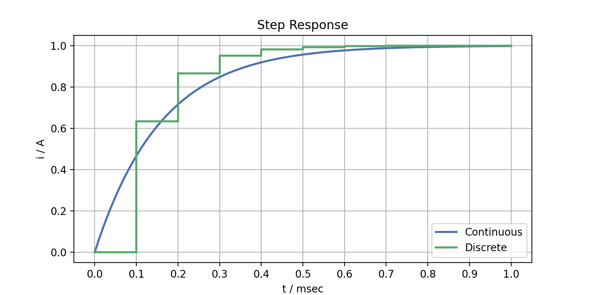
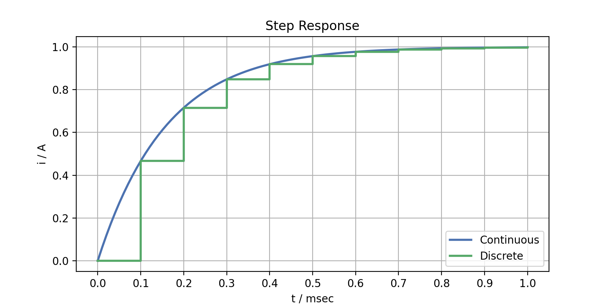

In field-oriented control (FOC), the inner current control loop serves as the foundation for all higher-level control loops. PI controllers are a common choice, designed as compensation controllers. However, in digital implementation, there are several pitfalls that can be avoided early in the design process.

## Plant Model

We begin by considering a linear, already compensated and decoupled voltage equation:

$$ 
u = R \, i + L \frac{di}{dt} 
$$  

where $R$ represents the resistance and $L$ the inductance. The transfer function of the plant model is given by

$$ 
G_p(s) = \frac{1}{Ls + R}.
$$

## Continuous Design

The compensation controller should be designed in such a way that the closed-loop transfer function

$$ 
G_w(s) = \frac{G_r(s) \, G_p(s)}{1 + G_r(s) \, G_p(s)} \overset{!}{=} \frac{1}{T_w \, s + 1} 
$$ 

matches the transfer function of a first-order system with the desired time constant $T_w$. This time constant can alternatively be defined by the desired bandwidth $f_w$ as

$$ 
T_w = \frac{1}{2 \pi f_w}. 
$$

Compensation control can be achieved with a PI controller 

$$ 
G_r(s) = K_p + \frac{K_i}{s} 
$$

using the control parameters

$$ 
K_p = \frac{L}{T_w}, \quad K_i = \frac{R}{T_w} .
$$

This leads to the closed-loop transfer function

$$ 
G_w(s) = \frac{K_p s + K_i}{L s^2 + (K_p + R) s + K_i} = \frac{(L s + R)}{(T_w s + 1)(L s + R)} = \frac{1}{T_w s + 1} .
$$ 

## Discrete Implementation

For implementation on a microcontroller, the controller algorithm needs to be discretized. A discrete PI controller (using backward rectangular rule) with the transfer function

$$ 
G_r(z) = \frac{(K_p + K_i \, t_s)  \, z - K_p}{z - 1} 
$$

and sampling time $t_s$ is a common choice. Excluding considerations for feedforward-terms, limitations, and anti-windup methods, the PI controller can be efficiently implemented on the target hardware as follows:

```c
/* control error */
e_k = i_ref - i_meas;
/* control output */
u_k = (K_P + K_I * T_S) * e_k + x_k;
/* control state */
x_k += (K_I * T_S) * e_k;
```

However, if the same control parameters from the continuous design are applied, the discrete closed-loop transfer function

$$ G_w(z) = \frac{1 - e^{-\frac{t_s}{T_w}}}{z - e^{-\frac{t_s}{T_w}}} $$ 
 
will not achieve the desired compensation and bandwidth. This discrepancy leads to a transfer behavior that deviates from that of the continuous design:



The differences become more pronounced as the desired bandwidth and sampling frequency approach each other: when they are far apart, the transfer behavior approximates that of the continuous compensation controller. When they are close together, the differences can even lead to instability in the discrete controller.

## Direct Discrete Design

The good news is, that there is no need to reduce the desired bandwidth or increase the sampling frequency. If the compensation control is directly designed for the discrete model equations, the control parameters calculate to
 
$$ K_p = \frac{R \, (1 - e^{-\frac{t_s}{T_w}}) \cdot e^{-\frac{t_s}{L/R}}}{1 - e^{-\frac{t_s}{L/R}}}, \quad K_i = \frac{R \, (1 - e^{-\frac{t_s}{T_w}})}{t_s} .$$

This ensures that, in the discrete case as well, both the pole compensation and the desired bandwidth are preserved. Now, during sampling the control variable matches that of the continuous compensation controller exactly:


